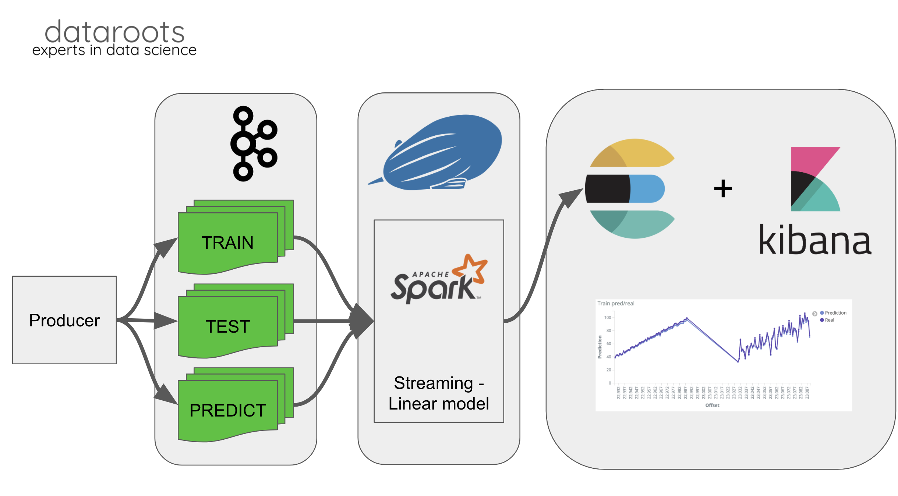
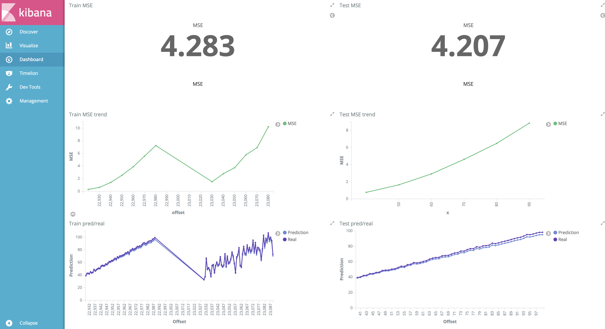
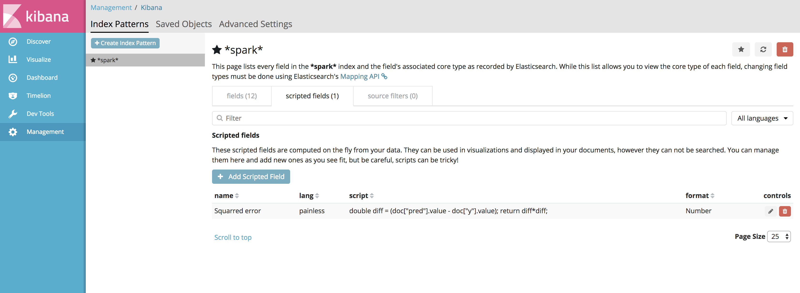
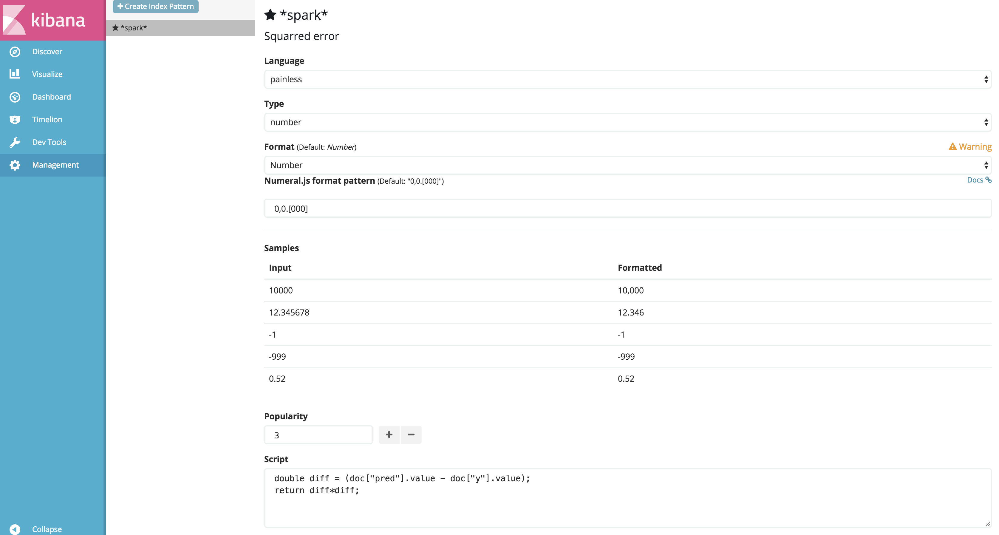
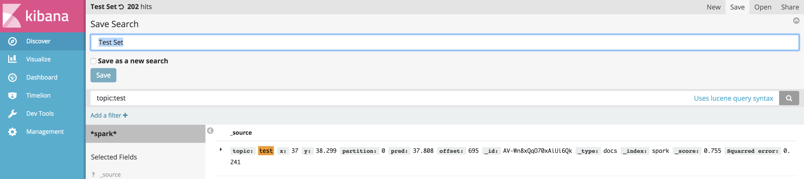
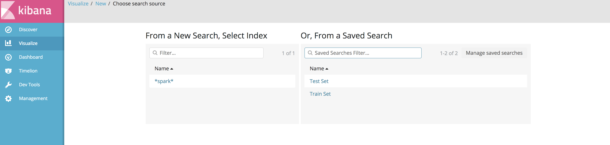
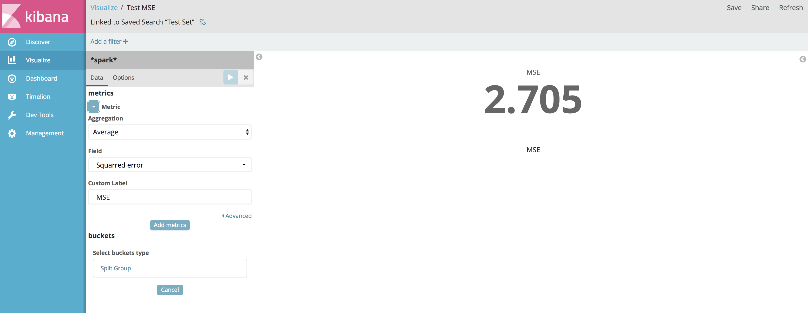
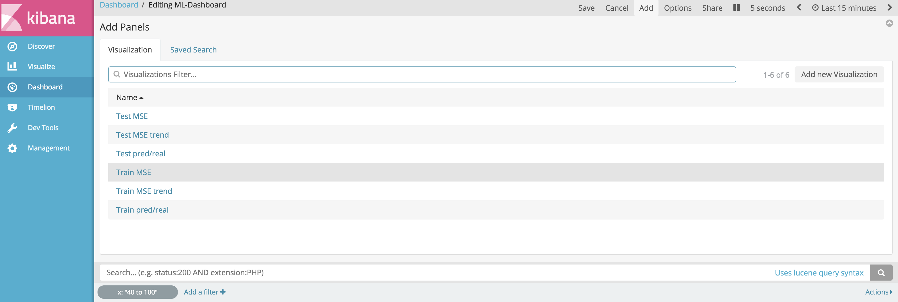
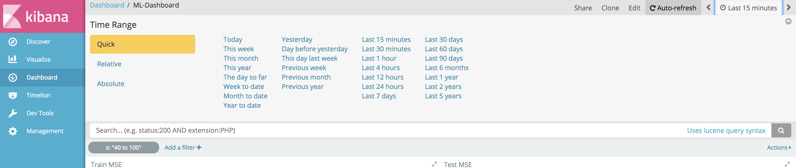

# Spark Streaming ML + Dashboard

## What's this about ?

In this repository we will quickly set up an infrastructure capable of monitoring a Spark Streaming machine learning model. In a second time we will deploy the said model and finally produce some dashboards (see below).

Every step to get to the final solution are given in the next sections.

## Disclaimer

This repository is **only a Proof Of Concept**. It is only **one** way to put such a model in production and to monitor it, certainly not the only one.

In order to use this in a production environment a lot more considerations have to be taken into account. Each of the technology used here needs to be carefully configured and optimally used. 

## Overview

First an overview of the architecture we will be putting in place



And the kind of dashboard we were able to produce:



Both for the train and the test set we have the following visualizations:

* The global MSE
* The evolution of the MSE in function of time (represented by the offset in the corresponding kafka topic)
* The data points streamed in along with their prediction

This dashboard is refreshed every 5 seconds to enable "real time" monitoring.


## 1. Launch the infrastructure

1. Find your local ip. E.g. using `ifconfig | grep inet`. Keep it somewhere.
2. In the `docker-compose.yml` file change the assignment of `KAFKA_ADVERTISED_HOST_NAME` with the previously found IP.
3. Launch the infrastructure by running `docker-compose build` and `docker-compose up`
4. Once the command-line standard output is static, in another terminal run `docker ps`. The output should look like

```
CONTAINER ID        IMAGE                              COMMAND                  CREATED             STATUS              PORTS                                                                              NAMES
3c71ec58b161        gwilym/wurstmeister-kafka-docker   "start-kafka.sh"         3 hours ago         Up About an hour    0.0.0.0:9092->9092/tcp                                                             deploymentsparkml_kafka_1
e389fe1c32a5        xemuliam/zeppelin                  "/bin/sh -c ./star..."   31 hours ago        Up About an hour    0.0.0.0:4040->4040/tcp, 0.0.0.0:8080->8080/tcp, 0.0.0.0:8443->8443/tcp             deploymentsparkml_zeppelin_1
34e8a8a344a4        sebp/elk                           "/usr/local/bin/st..."   4 days ago          Up About an hour    0.0.0.0:5044->5044/tcp, 0.0.0.0:5601->5601/tcp, 0.0.0.0:9200->9200/tcp, 9300/tcp   deploymentsparkml_elk_1
7eb4cb5893b9        wurstmeister/zookeeper             "/bin/sh -c '/usr/..."   4 days ago          Up About an hour    22/tcp, 2888/tcp, 3888/tcp, 0.0.0.0:2181->2181/tcp                                 deploymentsparkml_zookeeper_1

```

You can also try to access some UIs:

* [Zeppelin](http://localhost:8080/)
* [Kibana](http://localhost:5601/)
* [Elasticsearch](http://localhost:9200) which is not a UI but should render some information about the elasticsearch installation.

### Troubleshooting.

As we can see in the output, we start multiple services:

* Zookeeper
* Kafka
* Zeppelin (with Spark on standalone)
* The ELK stack (Elasticsearch Logstash Kibana)

If for one reason or another, one of these service fails to start try the following:

* Restart the whole infrastructure (Kafka docker has a tendency to fail)
* Allow more ressources to docker (6GB were enough in my case)


For the further steps We'll **assume** you have **everything running**.

##  2. Get the model running

Access the [Zeppelin UI](http://localhost:8080/)

### Configure Zeppelin

Access the settings from Zeppelin


1. Add the Spark-Packages maven repository
	* In the interpreter tab (top right drop down menu, see above picture)
	* Top right: click `Repository`
	* Add a new one
		* ID : `Spark-packages`
		* URL : `https://dl.bintray.com/spark-packages/maven/`
		* Leave the rest empty and add.
2. Add the necessary Maven dependencies for the spark interpreter.
	* Still in the interpreter tab
	* Search for the `Spark` interpreter (It's also the last one)
	* Click on edit
		* Change one of the properties `master` to `local[1]`.
		* At the bottom add following artifacts (leaving the exclude part empty)
			* `org.apache.spark:spark-streaming-kafka-0-10_2.11:2.1.0`
			* `org.apache.kafka:kafka_2.11:0.10.0.0`
			* `org.elasticsearch:elasticsearch-spark-20_2.11:5.6.3`
3. Save the changes

### Build the model

The [notebooks](notebooks) directory contains the Zeppelin notebooks necessary to have a model running and a producer to create some data. 

1. Import the [corresponding notebook](notebooks/Streaming_ML.json)
2. Change the cell where the `myIP` variable is assigned, replace it with your own.
3. Each cell is commented but you can also simply run the whole notebook.

In the end you should have a StreamingLinearModel running and producing results into Elasticsearch.


### Produce some data

1. Import the [corresponding notebook](notebooks/Producer.json)
2. Change the cell where the `myIP` variable is assigned, replace it with your own.
3. Depending whether you want to produce train or test data, change the `topic` variable.
4. Each cell is commented but you can also simply run the whole notebook.

You just created some train data and pushed it to the `train` kafka topic. This topic is consumed by our machine learning algorithm to train the model.

## 3. Explore the results and produce some dashboard.

We will now create some custom vizualisations on top of the data produced by the spark Streaming application. We focus on producing a dashboard for the train data. Similar steps can be followed to obtain the same vizualisations for the test data.

Access the [Kibana UI](http://localhost:5601/)

### Add the spark index

In the `management/indexed patterns`tab load all indexes containing `spark`.


### Add the `Squarred Error` as a scripted field

Once you've loaded the `spark` index. Add an extra field in the `scripted field` tab. We simply create the `Squarred error` field from the prediction (`pred`) and the actual value (`y`)





For convenience, the formula is repeated here:

```
double diff = (doc["pred"].value - doc["y"].value);
return diff*diff;
```

Save everything.

### Create the `Train set` search

Go in the `Discover` tab. You should be able to see the data created by the spark streaming application along with all the available fields. 

1. In the search bar type `topic:train` to only consider data comming from the `train` topic



2. Using the top right button, save your search for later use.


### Create some visualization

Go in the `Visualize` tab. Choose to `add` a new visualization.

Select our previously created `Train set` source.



Select the type of chart. In our case a `Metric` and fill in the different fields.



Save your visualization, give it a name.

### Add your vizualisation to a dashboard.

Now that we have some available visualization(s), let's go in the `Dashboard` tab.

Create a new dashboard and add you previously created visualization



In order to have your dashboard "real-time" updated, in the top right corner click on `Last 15 Minutes`. The `Auto-refresh` tab just appeared. By selecting it, you can decide the refresh rate of your dashboard.



Save your dashboard. 

With similar steps, it is possible to have a dashboard reporting both train and test data metrics. Every object created : searches, visualizations, dashboards can be imported using our export provided [here](kibana/all-export.json)


